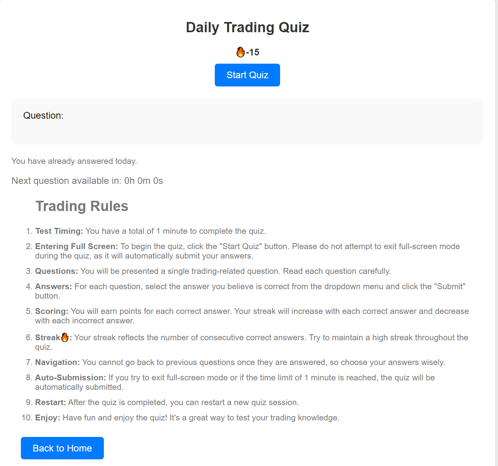

# Trading Quiz App



> **Trading Quiz App** is an interactive web application that allows users to test their knowledge of trading concepts and improve their skills. The app includes a timed quiz, streak tracking, and a variety of trading-related questions.

## Table of Contents

- [Demo](#demo)
- [Features](#features)
- [Getting Started](#getting-started)
- [Usage](#usage)
- [Contributing](#contributing)
- [License](#license)

---

## Demo

You can try out the app live at [Demo Link](https://ajmal112.github.io/JavaScript_Trading_Quiz_App/).

---

## Features

- **Timed Quiz:** Users have 1 minute to answer each question.
- **Streak Tracking:** Keep track of your correct answers streak.
- **Randomized Questions:** Questions are randomized to keep the quiz challenging.
- **Interactive UI:** An attractive and user-friendly interface.

---

## Getting Started

Follow these steps to get the Trading Quiz App up and running on your local machine:

1. **Clone the repository:**

   ```bash
   git clone https://github.com/yourusername/trading-quiz-app.git

Navigate to the project directory:
`cd trading-quiz-app`

Open the app in your web browser:
You can open the `index.html` file directly in your web browser to run the app.


## Usage

- Click the "Start Quiz" button to begin the quiz.
- Answer the questions within the time limit.
- Your streak and score will be displayed on the screen.
- After the quiz, you'll see a message indicating your performance.

## Contributing

Contributions are welcome! If you'd like to contribute to this project, please follow these steps:

1. Fork the project.
2. Create your feature branch (`git checkout -b feature/your-feature-name`).
3. Commit your changes (`git commit -m 'Add some feature'`).
4. Push to the branch (`git push origin feature/your-feature-name`).
5. Open a pull request.

## License

This project is licensed under the MIT License.

